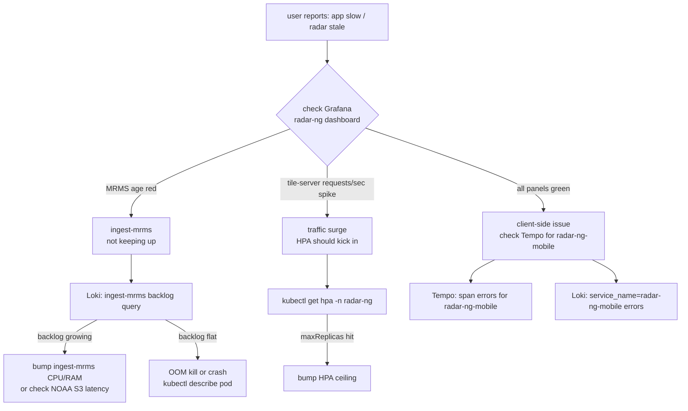

# radar-ng observability cookbook

App-specific guide for the radar-ng observability stack. The platform-level
docs (collector layout, retention, storage backends) live in
[`monitoring/README.md`](../monitoring/README.md) — this one is just the
"how do I find out what radar-ng is doing right now" reference.

## Signal sources

| component | sink | how it gets there |
|---|---|---|
| `radar-ng-mobile` (Expo app) | Tempo + Loki | OTel SDK in `src/lib/telemetry.ts` → OTLP/HTTP → `otel.tuxgrid.com` (gateway) |
| `tile-server` API logs | Loki | stdout JSON → otel-agent (DaemonSet) → gateway → Loki |
| `tile-server` `/api/metrics` | Prometheus | ServiceMonitor at `my-apps/development/radar-ng/servicemonitor.yaml` |
| `ingest-mrms` / `ingest-hrrr` / `ingest-lightning` / `ingest-tropical` / `nowcast` / `basemap` / `open-meteo` logs | Loki | same pipeline as tile-server |
| Pod CPU / memory / OOM | Prometheus | kube-state-metrics + cadvisor |

OTel-semconv labels in Loki: `k8s_namespace_name`, `k8s_pod_name`,
`k8s_container_name`, `service_name`. Promtail-style `namespace` /
`pod` labels do **not** exist — selectors using them return "No data".

## Grafana — the radar-ng dashboard

Auto-imported from [`monitoring/prometheus-stack/radar-ng-dashboard.yaml`](../monitoring/prometheus-stack/radar-ng-dashboard.yaml).
Labelled `grafana_dashboard: "1"` so the sidecar picks it up. Open in
Grafana → Dashboards → search "radar-ng".

| panel | tells you |
|---|---|
| **MRMS radar data age (s)** | live `radar_ng_mrms_age_seconds` — green < 300, red > 600 |
| **tile-server requests/sec by endpoint** | rate(`radar_ng_*_requests_total`) — manifest vs forecast traffic split |
| **Forecast cache hit %** | `radar_ng_forecast_cache_hits_total / radar_ng_forecast_requests_total` |
| **Log volume by container** | Loki `count_over_time({k8s_namespace_name="radar-ng"})` |
| **Recent error lines** | Loki tail filtered by error/warn |
| **Tile timestamps per layer** | gauge per layer — should always be 3 frames behind in steady state |
| **Pod CPU vs request** | which pods are CPU-bound vs idle |
| **Pod memory vs limit** | early-warning before OOM |
| **tile-server HPA replicas** | 2–6 swing under load |
| **OOM kills (1h)** | should be 0 |
| **Container restarts (1h)** | should be 0 |

## Loki query cookbook

Paste into Grafana → Explore → Loki.

### Catch-all: anything bad happening in radar-ng

```logql
{k8s_namespace_name="radar-ng"} |~ "(?i)error|warn|exception|traceback"
```

### Render-cycle timing for ingest-mrms

```logql
{k8s_namespace_name="radar-ng", k8s_pod_name=~"ingest-mrms.*"}
  | json
  | msg = "frame_done"
  | line_format "{{.timestamp}} took {{.duration_s}}s"
```

Steady state: ~120 s per frame with parallel palettes. > 200 s = look at
CPU saturation.

### Tile-server slow requests

```logql
{k8s_namespace_name="radar-ng", k8s_pod_name=~"tile-server.*"}
  | json
  | duration > 1.0
  | line_format "{{.duration}}s {{.request_uri}}"
```

### Backlog growing on ingest-mrms

```logql
{k8s_namespace_name="radar-ng", k8s_pod_name=~"ingest-mrms.*"}
  | json | msg = "processing_batch"
  | line_format "backlog={{.backlog}} rendering={{.rendering}}"
```

If `backlog` keeps climbing across cycles, the ingester is falling behind.

### Lightning ingester reconnects

```logql
{k8s_namespace_name="radar-ng", k8s_pod_name=~"ingest-lightning.*"}
  |~ "ws_disconnect|reconnect"
```

Blitzortung WS will drop several times per hour — that's normal. Sustained
reconnects (one per minute or worse) = upstream issue, not your problem.

### Mobile app red-screen crashes

```logql
{service_name="radar-ng-mobile"} |= "ERROR"
```

The app's `telemetry.ts` hooks into `ErrorUtils.setGlobalHandler` so every
fatal red-screen and unhandled promise rejection lands here with stack trace.

### Find logs for a specific trace

In Tempo, copy the trace_id, then:

```logql
{k8s_namespace_name="radar-ng"} |= "<trace_id>"
```

Backend logs include the trace_id in the JSON envelope when the request was
triggered by an instrumented client call.

### Tile-server connection failures (e.g. basemap pod restarting)

```logql
{k8s_namespace_name="radar-ng", k8s_pod_name=~"tile-server.*"}
  |~ "dial tcp .* connect: (refused|timed out|operation not permitted)"
```

Spikes during pod rollouts are expected and self-resolve. Sustained errors
= check basemap pod health (`kubectl get pods -n radar-ng -l app=basemap`).

## Tempo (traces) — what spans the mobile app emits

`src/lib/telemetry.ts` exposes a `trace()` helper:

```ts
await trace("manifest.fetch", async (span) => {
  span.setAttribute("server", serverUrl);
  return await fetchSelfHostedManifest(serverUrl);
});
```

Currently instrumented spans:

| span name | where | attributes |
|---|---|---|
| `map.fetchStyle` | `WeatherMap.tsx::usePatchedMapStyle` | `map.style`, `http.status_code` |

Service name: `radar-ng-mobile`. Search in Grafana → Explore → Tempo by
service. Click any span → "Logs for this span" pulls correlated Loki lines.

To correlate with backend, ensure your backend hook propagates the
`traceparent` header from the OTLP request through to its own logger. Right
now FastAPI in `tile-server` doesn't auto-propagate — instrumentation TODO.

## Prometheus — radar-ng metric reference

Exposed at `tile-server.radar-ng.svc/api/metrics`. ServiceMonitor at
`my-apps/development/radar-ng/servicemonitor.yaml` picks them up.

| metric | type | what it is |
|---|---|---|
| `radar_ng_forecast_requests_total` | counter | every `/api/forecast/{lat}/{lon}` hit |
| `radar_ng_forecast_cache_hits_total` | counter | the subset served from in-memory 5-min cache |
| `radar_ng_forecast_upstream_errors_total` | counter | Open-Meteo upstream 5xx |
| `radar_ng_manifest_requests_total` | counter | every `/api/manifest.json` hit (mostly mobile clients) |
| `radar_ng_tile_timestamps{layer="…"}` | gauge | how many frames are currently retained per layer |
| `radar_ng_mrms_age_seconds` | gauge | seconds since the latest MRMS frame was rendered |

### Useful PromQL

```promql
# Manifest QPS over the last 5 min
rate(radar_ng_manifest_requests_total[5m])

# Forecast cache hit ratio (one number)
sum(rate(radar_ng_forecast_cache_hits_total[5m]))
  / clamp_min(sum(rate(radar_ng_forecast_requests_total[5m])), 1)

# Are tiles current? alert if MRMS age > 10 min for 5 min
radar_ng_mrms_age_seconds > 600

# Per-layer tile retention — should hover near a fixed number
radar_ng_tile_timestamps
```

## Alert candidates (not yet wired)

Suggested PrometheusRule entries to add when you want pager-grade alerts:

```yaml
- alert: RadarNgMrmsStale
  expr: radar_ng_mrms_age_seconds > 900
  for: 5m
  annotations:
    summary: "radar-ng: MRMS frame > 15 min old"

- alert: RadarNgIngestMrmsRestarting
  expr: increase(kube_pod_container_status_restarts_total{namespace="radar-ng",pod=~"ingest-mrms.*"}[15m]) > 2
  for: 5m
  annotations:
    summary: "radar-ng: ingest-mrms restarting"

- alert: RadarNgForecastUpstreamErrors
  expr: rate(radar_ng_forecast_upstream_errors_total[5m]) > 0.1
  for: 10m
  annotations:
    summary: "radar-ng: Open-Meteo upstream errors"
```

Drop these into `monitoring/prometheus-stack/` as a `PrometheusRule`.

## Troubleshooting flow



## Related links

- [`monitoring/README.md`](../monitoring/README.md) — platform observability layout
- [`monitoring/CLAUDE.md`](../monitoring/CLAUDE.md) — design rationale + pitfalls
- [`monitoring/prometheus-stack/radar-ng-dashboard.yaml`](../monitoring/prometheus-stack/radar-ng-dashboard.yaml) — the dashboard JSON
- [`my-apps/development/radar-ng/servicemonitor.yaml`](../my-apps/development/radar-ng/servicemonitor.yaml) — Prometheus scrape config
- radar-ng repo: `src/lib/telemetry.ts` — mobile OTel wiring
- radar-ng repo: `services/shared/logger.py` — backend JSON logger
