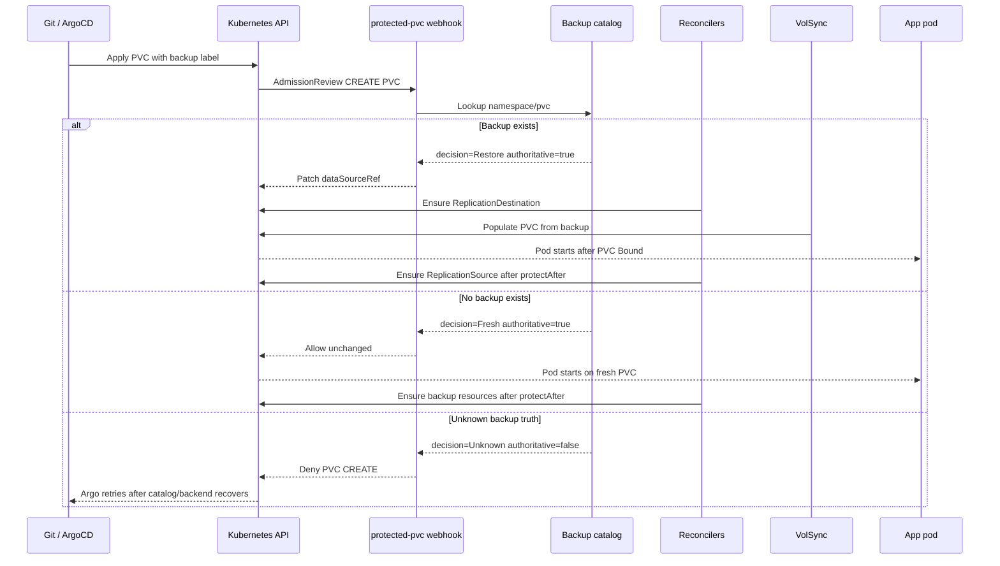

# Protected PVC Controller PRD

Date: 2026-04-28

Status: expanded product requirements draft.

## Product Name

Working name: `protected-pvc-controller`

API group: `storage.vanillax.dev`

## Executive Summary

Build a Kubernetes controller plus admission webhook that turns a simple PVC backup label into a complete, safe backup and restore lifecycle.

The controller replaces the fragile parts of the current Kyverno + pvc-plumber arrangement while preserving the best part of the user experience:

```yaml
metadata:
  labels:
    backup: "hourly"
```

The controller must decide at PVC creation time whether to:

- restore from an existing backup,
- create a fresh PVC because no backup exists,
- or block creation because backup truth is unknown.

This keeps the zero-click GitOps restore model while moving the logic into a purpose-built control plane with status, metrics, drift correction, and safer scheduling.

This is not a weekend replacement for Kyverno. Treat it as a staged platform component: first prove the hardened bridge with restore drills, then ship an observe-only controller, then move reconciliation, and only then move admission.

## ELI5 Summary

Today, a helper service and Kyverno ask, "Does this PVC already have a backup?" If yes, they restore it before the app starts; if no, the app gets a fresh empty disk; if the answer is unclear, the PVC is blocked.

The controller idea turns that into a real Kubernetes product: one controller remembers backup truth, makes the admission decision, creates the VolSync restore/backup objects, and reports status instead of spreading the behavior across Kyverno rules and a sidecar API.

## Product Thesis

The unusual part of this homelab is not "backing up PVCs." The unusual part is **conditional restore at PVC creation time** with no operator action.

Most backup systems assume a human or runbook chooses restore mode. This design assumes the cluster can be rebuilt from Git and should automatically choose:

```text
----------------+       +-----------------------+
| Git says PVC   | ----> | Is there a backup?    |
| should exist   |       +-----------+-----------+
+----------------+                   |
                                     |
                 +-------------------+-------------------+
                 |                   |                   |
                 v                   v                   v
          +-------------+      +-------------+      +-------------+
          | Restore old |      | Create new  |      | Wait/deny   |
          | data first  |      | empty PVC   |      | unsafe path |
          +-------------+      +-------------+      +-------------+
```

That decision must happen before Kubernetes binds the PVC and before the app initializes state.

## Bridge Gate Before Controller

The current hardened Kyverno + pvc-plumber bridge is the mandatory proving ground. Do not start webhook enforcement until these bridge drills pass in a disposable namespace:

| Drill | Setup | Expected Result | Evidence To Capture |
|---|---|---|---|
| Fresh install | Create backup-labeled PVC with no Kopia/S3 backup | PVC admitted unchanged, app starts fresh | pvc-plumber decision `fresh`, Kyverno allow, PVC has no `dataSourceRef` |
| Restore install | Delete app/PVC after known backup exists, then reapply Git | PVC admitted with `dataSourceRef`, VolSync restores before app starts | pvc-plumber decision `restore`, PVC `dataSourceRef`, app sees old data |
| pvc-plumber down | Scale pvc-plumber to zero, apply backup-labeled PVC | PVC CREATE denied | Kyverno admission denial and Argo retry |
| Kopia query error | Break repository path/password or make backend unavailable | PVC CREATE denied | pvc-plumber HTTP 503, decision `unknown`, Kyverno denial |
| Stale/slow backend | Force timeout longer than `HTTP_TIMEOUT` | PVC CREATE denied | timeout metric, decision `unknown` |
| App ordering | Apply app Deployment and PVC together during restore | Pod waits until restored PVC is bound | no empty app initialization |

Bridge completion criteria:

- `pvc-plumber:1.5.1` or newer is deployed.
- `/exists` returns tri-state `restore|fresh|unknown`.
- Unknown truth returns non-2xx and Kyverno maps call failures to `unknown`.
- Prometheus sees pvc-plumber metrics and alerts on unknown/error/down.
- At least one real app restore drill has been performed from Git.

## Problem Statement

Kubernetes can populate a PVC from a data source, but the PVC must know that source before it binds. Existing backup tools generally require an explicit restore object, selected backup, UI action, CLI action, or per-app restore manifest.

That breaks this desired workflow:

```text
Git declares app + PVC
  |
  v
Cluster decides if old backup exists
  |
  +-- yes --> restore before app initializes state
  |
  +-- no --> create fresh for first install
  |
  +-- unknown --> block to avoid silent data loss
```

The current platform solves this with Kyverno, pvc-plumber, VolSync, and Kopia. It works conceptually, but it spreads one product across several loosely coupled mechanisms:

- Kyverno handles admission mutation and resource generation.
- pvc-plumber answers backup existence.
- VolSync performs backup/restore.
- Kopia stores backup data.
- Cleanup and status are indirect.

The real product is missing a dedicated API and controller.

## Goals

- Preserve one-label app ergonomics for common PVCs.
- Make backup truth tri-state and fail closed.
- Keep app pods from starting on empty volumes when backups exist or backup truth is unknown.
- Generate and reconcile VolSync resources automatically.
- Provide first-class status per protected PVC.
- Replace recurring unsafe Kopia maintenance assumptions.
- Support GitOps rebuilds without GUI, scripts, or comment toggles.
- Support 100+ apps without per-app restore manifests.

## Requirements

### Functional Requirements

| ID | Requirement | Priority |
|---|---|---|
| FR-1 | Match protected PVCs from labels and `PVCProtectionClass` selectors | P0 |
| FR-2 | Decide `Restore`, `Fresh`, or `Unknown` before protected PVC creation binds | P0 |
| FR-3 | Mutate restore PVCs with `spec.dataSourceRef` pointing at a VolSync `ReplicationDestination` | P0 |
| FR-4 | Deny protected PVC creation when backup truth is unknown | P0 |
| FR-5 | Generate or adopt ExternalSecret, ReplicationSource, and ReplicationDestination resources | P0 |
| FR-6 | Publish `PVCProtection` status for every protected PVC | P0 |
| FR-7 | Stagger backup schedules deterministically across minutes | P0 |
| FR-8 | Exempt intentionally disposable PVCs with explicit labels and auditable reasons | P1 |
| FR-9 | Run observe/shadow mode beside the current Kyverno + pvc-plumber bridge | P1 |
| FR-10 | Provide migration tooling or controller adoption rules for existing Kyverno-generated resources | P1 |
| FR-11 | Surface restore drill status and last successful restore evidence | P1 |

### Nonfunctional Requirements

| Area | Requirement |
|---|---|
| Availability | Admission webhook runs at least 2 replicas with leader election for reconcilers |
| Failure mode | Matching protected PVC admission fails closed when the webhook or catalog is unavailable |
| Latency | P95 admission decision under 250 ms from in-memory catalog |
| Scale | 250 protected PVCs and 2,000 snapshots without per-admission Kopia shell-out |
| Catalog freshness | Configurable max staleness, default 10 minutes |
| GitOps | All configuration is declarative YAML; no GUI or comment toggles required |
| Security | Least-privilege RBAC; no namespace gets cluster-wide backup credentials |
| Upgrade | CRDs support conversion or documented v1alpha1 to v1beta1 migration before enforce mode |
| Observability | Metrics, events, and status conditions must explain every deny/restore/fresh decision |

### Success Metrics

| Metric | Target |
|---|---:|
| Unknown decisions during healthy steady state | 0 |
| Protected PVCs with stale catalog | 0 |
| Admission decision P95 | <250 ms |
| Reconciler drift repair time | <2 minutes |
| Full GitOps rebuild manual restore steps | 0 |
| Restore drills passing before enforce rollout | 100% of gate drills |

## Non-Goals

- Replace Longhorn.
- Replace VolSync.
- Replace Kopia.
- Replace database-native backups such as CNPG/Barman.
- Build a generic enterprise backup product with RBAC portals and multi-tenant billing.
- Make NFS/SMB active storage for SQLite apps.
- Guarantee application-level consistency across unrelated database and filesystem restore points.

## Current Architecture

```text
                 Git
                  |
                  v
              ArgoCD sync
                  |
                  v
        +--------------------+
        | PVC with backup    |
        | label              |
        +---------+----------+
                  |
                  v
        +--------------------+
        | Kyverno admission  |
        | validate + mutate  |
        +----+----------+----+
             |          |
             |          v
             |    +-------------+
             |    | pvc-plumber |
             |    | /exists     |
             |    +------+------+ 
             |           |
             |           v
             |        Kopia on NFS
             |
             v
   +-----------------------+
   | Kyverno generate      |
   | ExternalSecret        |
   | ReplicationSource     |
   | ReplicationDestination|
   +-----------+-----------+
               |
               v
            VolSync
```

Pre-hardening weakness that Phase 0 fixed:

```text
/readyz OK + /exists error -> exists false -> empty PVC
```

## Target Architecture

```text
                 Git
                  |
                  v
              ArgoCD sync
                  |
                  v
        +--------------------+
        | PVC with backup    |
        | label              |
        +---------+----------+
                  |
                  v
     +---------------------------+
     | protected-pvc admission   |
     | webhook                   |
     +------+---------+----------+
            |         |
            |         v
            |  +----------------+
            |  | Backup catalog |
            |  | cache          |
            |  +-------+--------+
            |          |
            |          v
            |       Kopia
            |
            v
   +------------------------------+
   | PVC admission decision       |
   | restore | fresh | deny       |
   +---------------+--------------+
                   |
                   v
     +----------------------------+
     | protected-pvc reconciler   |
     | creates/repairs VolSync    |
     | resources and status       |
     +-------------+--------------+
                   |
                   v
                VolSync
```

## Target Swimlane



## Core Decision Table

| Catalog State | Backup Entry | Repository Health | Decision | Admission | Reason |
|---|---|---|---|---|---|
| Fresh | Found | Healthy | `Restore` | Allow + mutate | Existing backup must win over app initialization |
| Fresh | Missing | Healthy | `Fresh` | Allow unchanged | First install or intentionally new PVC |
| Missing | Unknown | Healthy | `Unknown` | Deny | Catalog has not proven absence |
| Stale | Any | Healthy or unhealthy | `Unknown` | Deny | Stale truth is not safe truth |
| Refresh failed | Any | Unhealthy | `Unknown` | Deny | Backend unavailable |
| Config invalid | Any | Unknown | `Unknown` | Deny | Operator must fix class/repository |

## Boxes And Arrows: Restore Path

```text
+--------------------------+
| Argo applies PVC         |
| backup: hourly          |
+------------+-------------+
             |
             v
+--------------------------+
| Admission webhook        |
| asks local catalog       |
+------------+-------------+
             |
             v
+--------------------------+
| Catalog says backup      |
| exists for ns/pvc        |
+------------+-------------+
             |
             v
+--------------------------+
| Webhook mutates PVC      |
| spec.dataSourceRef       |
+------------+-------------+
             |
             v
+--------------------------+
| Reconciler ensures       |
| ReplicationDestination   |
+------------+-------------+
             |
             v
+--------------------------+
| VolSync populates PVC    |
| from Kopia backup        |
+------------+-------------+
             |
             v
+--------------------------+
| PVC Bound                |
| app pod starts           |
+------------+-------------+
             |
             v
+--------------------------+
| Reconciler creates       |
| ReplicationSource after  |
| protectAfter delay       |
+--------------------------+
```

## Boxes And Arrows: Fresh Path

```text
+--------------------------+
| Argo applies new app PVC |
| backup: daily           |
+------------+-------------+
             |
             v
+--------------------------+
| Admission webhook        |
| checks catalog           |
+------------+-------------+
             |
             v
+--------------------------+
| Catalog authoritative:   |
| no backup exists         |
+------------+-------------+
             |
             v
+--------------------------+
| Webhook allows PVC       |
| unchanged                |
+------------+-------------+
             |
             v
+--------------------------+
| Longhorn creates fresh   |
| volume                   |
+------------+-------------+
             |
             v
+--------------------------+
| Reconciler creates       |
| backup resources         |
+--------------------------+
```

## Boxes And Arrows: Unknown Path

```text
+--------------------------+
| Argo applies PVC         |
| backup: hourly          |
+------------+-------------+
             |
             v
+--------------------------+
| Admission webhook        |
| checks catalog           |
+------------+-------------+
             |
             v
+--------------------------+
| Catalog stale or Kopia   |
| unavailable              |
+------------+-------------+
             |
             v
+--------------------------+
| Webhook denies PVC       |
| creation                 |
+------------+-------------+
             |
             v
+--------------------------+
| Argo retries             |
| app waits                |
+--------------------------+
```

## Before / After

| Area | Current | Controller target |
|---|---|---|
| App interface | `backup: hourly|daily` label | Same label, plus optional advanced annotations |
| Backup decision | pvc-plumber HTTP call from Kyverno | In-process admission webhook backed by catalog |
| Unknown backup truth | Hardened Kyverno + pvc-plumber denies | Always deny in webhook |
| Resource generation | Kyverno generate rules | Controller reconciler |
| Drift repair | Indirect, limited | Continuous reconcile |
| Status | Spread across PVC, Kyverno, VolSync | `PVCProtection` status per PVC |
| Cleanup | Kyverno cleanup policy | Owner refs/finalizers |
| Backup schedule | Top-of-hour herd | Deterministic staggering |
| Kopia catalog | Per-request CLI and short cache | Periodic indexed catalog with freshness condition |
| Monitoring | VolSync and pvc-plumber decision/error alerts | Controller, webhook, catalog, VolSync metrics |
| Migration risk | Current live path | Shadow/adopt mode before enforcement |

## Compare And Contrast For Design Review

| Option | What It Solves Well | What It Does Poorly | Operational Cost | Recommendation |
|---|---|---|---|---|
| Keep hardened Kyverno + pvc-plumber | Preserves one-label app UX, fixes silent empty-PVC initialization, and needs the least new code | Splits decision logic across Kyverno and a service; generated resource drift is not continuously reconciled; no first-class per-PVC protection status | Low | Use as the immediate production bridge |
| Build `protected-pvc-controller` | Centralizes admission, restore decisions, generated resources, status, cleanup, schedule staggering, and metrics | Requires CRDs, webhook lifecycle, RBAC, controller testing, leader election, and upgrade discipline | Medium | Target long-term architecture |
| Use VolSync VolumePopulator directly | Keeps the upstream restore primitive and avoids custom decision code | Requires PVCs to know the restore source; does not answer "backup exists or fresh install?" | Medium per app | Keep as the restore mechanism, not the decision layer |
| Use Longhorn backup restore directly | Simple for one-off volume recovery | Manual/GUI-oriented at scale; restore timing can happen after app initialization | High during incidents | Emergency-only fallback |
| Use Velero/Kasten-style restore workflow | Broad DR ecosystem and namespace/app-level restore concepts | Restore is an explicit operation; per-PVC conditional GitOps semantics are weak for this requirement | Medium to high | Useful comparison, not a replacement |

Reviewer criteria:

- Preserve the low-overhead app interface.
- Prevent empty initialization when backup truth is unknown.
- Distinguish first install from rebuild without comment toggles or clickops.
- Provide a migration path from today's manifests to the controller without a flag day.
- Add enough reconciliation/status value to justify owning a CRD and webhook.

## User Experience

### Common Case

Users keep writing normal PVCs:

```yaml
apiVersion: v1
kind: PersistentVolumeClaim
metadata:
  name: data
  namespace: karakeep
  labels:
    backup: "hourly"
spec:
  accessModes:
    - ReadWriteOnce
  storageClassName: longhorn
  resources:
    requests:
      storage: 10Gi
```

### Explicit Exemption

```yaml
metadata:
  labels:
    backup-exempt: "cache"
```

Allowed exemption reasons:

- `cache`
- `scratch`
- `external-source`
- `media-on-nas`
- `database-native`
- `test`

### Advanced Optional Overrides

```yaml
metadata:
  annotations:
    storage.vanillax.dev/protect-after: "2h"
    storage.vanillax.dev/restore-policy: "IfBackupExists"
    storage.vanillax.dev/unknown-policy: "Deny"
```

The common case should not need annotations.

## Proposed CRDs

### `PVCProtectionClass`

Cluster-scoped policy for a class such as `hourly` or `daily`.

```yaml
apiVersion: storage.vanillax.dev/v1alpha1
kind: PVCProtectionClass
metadata:
  name: hourly
spec:
  selector:
    matchLabels:
      backup: hourly
  restore:
    policy: IfBackupExists
    unknownPolicy: Deny
  backup:
    schedule:
      type: HashedHourly
    protectAfter: 2h
    retention:
      hourly: 24
      daily: 7
      weekly: 4
      monthly: 2
  volsync:
    copyMethod: Snapshot
    volumeSnapshotClassName: longhorn-snapclass
    storageClassName: longhorn
    cacheCapacity: 2Gi
  repositoryRef:
    name: kopia-nfs
```

Daily class:

```yaml
apiVersion: storage.vanillax.dev/v1alpha1
kind: PVCProtectionClass
metadata:
  name: daily
spec:
  selector:
    matchLabels:
      backup: daily
  restore:
    policy: IfBackupExists
    unknownPolicy: Deny
  backup:
    schedule:
      type: HashedDaily
      hour: 2
    protectAfter: 2h
    retention:
      hourly: 24
      daily: 7
      weekly: 4
      monthly: 2
  volsync:
    copyMethod: Snapshot
    volumeSnapshotClassName: longhorn-snapclass
    storageClassName: longhorn
    cacheCapacity: 2Gi
  repositoryRef:
    name: kopia-nfs
```

### `PVCBackupRepository`

Cluster-scoped backend config.

```yaml
apiVersion: storage.vanillax.dev/v1alpha1
kind: PVCBackupRepository
metadata:
  name: kopia-nfs
spec:
  type: KopiaFilesystem
  identity:
    sourceFormat: "{pvc}-backup@{namespace}:/data"
  secret:
    externalSecretStoreRef:
      kind: ClusterSecretStore
      name: 1password
    remoteRef:
      key: rustfs
      property: kopia_password
  filesystem:
    mount:
      nfs:
        server: 192.168.10.133
        path: /mnt/BigTank/k8s/volsync-kopia-nfs
      mountPath: /repository
  catalog:
    refreshInterval: 2m
    maxStaleness: 10m
```

### `PVCProtection`

Namespaced status object for one protected PVC. The controller may generate this automatically for every matching PVC, or users may create it explicitly later for advanced cases.

```yaml
apiVersion: storage.vanillax.dev/v1alpha1
kind: PVCProtection
metadata:
  name: data
  namespace: karakeep
spec:
  pvcName: data
  className: hourly
status:
  phase: Protected
  decision: Restore
  backup:
    source: data-backup@karakeep:/data
    latestSnapshotTime: "2026-04-28T06:00:00Z"
  generated:
    externalSecret: volsync-data
    replicationSource: data-backup
    replicationDestination: data-backup
  conditions:
    - type: CatalogReady
      status: "True"
      reason: Fresh
    - type: RestoreDecisionMade
      status: "True"
      reason: BackupFound
    - type: ReplicationDestinationReady
      status: "True"
      reason: ReadyForRestore
    - type: ReplicationSourceReady
      status: "True"
      reason: ScheduleActive
```

## CRD Contract Details

### `PVCProtectionClass.spec`

| Field | Type | Required | Default | Notes |
|---|---|---:|---|---|
| `selector.matchLabels` | map | yes | none | Selects PVCs by label, normally `backup: hourly|daily` |
| `restore.policy` | enum | yes | `IfBackupExists` | First version supports `IfBackupExists` only |
| `restore.unknownPolicy` | enum | yes | `Deny` | First version must support `Deny`; `AllowFresh` is intentionally not supported |
| `backup.schedule.type` | enum | yes | none | `HashedHourly`, `HashedDaily`, or explicit cron later |
| `backup.schedule.hour` | int | no | `2` for daily | Hour in cluster local time unless UTC is later chosen |
| `backup.protectAfter` | duration | no | `2h` | Prevents immediate backup of newly restored/fresh PVCs |
| `backup.retention` | object | yes | class-specific | Maps to VolSync/Kopia retention |
| `volsync.copyMethod` | enum | yes | `Snapshot` | Must match current working VolSync pattern |
| `volsync.volumeSnapshotClassName` | string | yes | none | Longhorn snapshot class |
| `volsync.storageClassName` | string | yes | none | Restore target storage class |
| `volsync.cacheCapacity` | quantity | no | `2Gi` | VolSync cache PVC size |
| `repositoryRef.name` | string | yes | none | References `PVCBackupRepository` |

### `PVCBackupRepository.spec`

| Field | Type | Required | Notes |
|---|---|---:|---|
| `type` | enum | yes | `KopiaFilesystem` first; S3 can be added after parity |
| `identity.sourceFormat` | string | yes | Default `{pvc}-backup@{namespace}:/data` |
| `secret.externalSecretStoreRef` | object | yes | Reuses existing External Secrets trust model |
| `secret.remoteRef` | object | yes | Points to Kopia password source |
| `filesystem.mount.nfs` | object | yes for NFS | Server/path for controller catalog and VolSync movers |
| `filesystem.mount.mountPath` | string | yes | Default `/repository` |
| `catalog.refreshInterval` | duration | yes | Default `2m` |
| `catalog.maxStaleness` | duration | yes | Default `10m` |

### `PVCProtection.status`

| Field | Meaning |
|---|---|
| `phase` | Human-readable lifecycle phase |
| `decision` | Last controller decision: `Restore`, `Fresh`, `Unknown`, or `Disabled` |
| `decisionObservedAt` | Time the decision was made |
| `backup.source` | Kopia source string used for lookup |
| `backup.latestSnapshotTime` | Newest snapshot observed for this PVC |
| `catalog.generation` | Catalog generation used for the decision |
| `catalog.observedAt` | Catalog refresh time used for the decision |
| `generated.*` | Names of generated/adopted resources |
| `conditions[]` | Kubernetes-style conditions for catalog, restore, backup, drift, and maintenance |

Minimum condition set:

| Condition | True Meaning | False/Unknown Meaning |
|---|---|---|
| `CatalogReady` | Catalog refresh is within max staleness | Webhook should deny protected PVCs |
| `DecisionReady` | Restore/fresh decision is authoritative | PVC creation is blocked |
| `RestoreReady` | Required ReplicationDestination exists | Restore PVC may remain pending |
| `BackupReady` | ReplicationSource exists and latest run healthy | Backup SLO may be violated |
| `GeneratedResourcesReady` | Managed objects match desired state | Reconciler is still repairing drift |
| `MaintenanceReady` | Last repository maintenance succeeded | Operator should inspect Kopia |

## Controller Components

### 1. Admission Webhook

Responsibilities:

- Intercept PVC CREATE.
- Match PVCs to a `PVCProtectionClass`.
- Query backup catalog.
- Mutate PVC with `dataSourceRef` when decision is `Restore`.
- Allow unchanged PVC when decision is `Fresh`.
- Deny PVC when decision is `Unknown`.
- Emit audit events and metrics for every decision.

The webhook must not shell out to Kopia per request in the steady state. It should query an in-process catalog cache that has a freshness condition.

### 2. Backup Catalog Manager

Responsibilities:

- Connect to the Kopia repository.
- Periodically run `kopia snapshot list --all --json`.
- Build an index keyed by `namespace/pvc`.
- Record latest snapshot time and source identity.
- Expose freshness to webhook readiness.
- Mark catalog unknown when refresh fails or exceeds max staleness.

Catalog rule:

```text
fresh catalog + source exists      -> Restore
fresh catalog + source missing     -> Fresh
stale catalog or refresh failure   -> Unknown
```

### 3. Resource Reconciler

Responsibilities:

- Watch PVCs, `PVCProtectionClass`, `PVCBackupRepository`, `ReplicationSource`, `ReplicationDestination`, and ExternalSecret resources.
- Create or repair ExternalSecret for Kopia credentials.
- Create or repair ReplicationDestination before restore PVC creation when possible.
- Create ReplicationSource only after PVC is Bound and older than `protectAfter`.
- Apply deterministic backup schedule staggering.
- Maintain `PVCProtection` status.

### 4. Cleanup Reconciler

Responsibilities:

- Remove generated VolSync resources when backup labels are removed.
- Respect backup retention policy.
- Never delete Kopia snapshots unless a future explicit destructive policy exists.
- Handle orphaned generated resources with owner references and finalizers.

### 5. Maintenance Reconciler

Responsibilities:

- Replace the hand-written recurring Kopia maintenance job.
- Run safe maintenance with default safety.
- Never schedule recurring `--safety=none`.
- Surface maintenance status and failures.

## Decision Model

| Decision | Meaning | Admission result |
|---|---|---|
| `Restore` | Authoritative backup exists | allow + mutate |
| `Fresh` | Authoritative no-backup result | allow unchanged |
| `Unknown` | Catalog stale, backend error, bad config, or ambiguous response | deny |

## Schedule Staggering

The controller should avoid herd behavior by default.

For hourly backups:

```text
minute = stable_hash(namespace + "/" + pvcName) % 60
schedule = "{minute} * * * *"
```

For daily backups:

```text
minute = stable_hash(namespace + "/" + pvcName) % 60
schedule = "{minute} 2 * * *"
```

This keeps the user contract simple while spreading load.

## Status Phases

| Phase | Meaning |
|---|---|
| `PendingDecision` | PVC seen, catalog decision not ready |
| `Blocked` | PVC creation denied because decision is unknown |
| `CreatingFresh` | No backup exists, normal PVC allowed |
| `Restoring` | Backup exists, PVC created with `dataSourceRef` |
| `Bound` | PVC is bound |
| `Protected` | Backup schedule exists and is healthy |
| `Degraded` | Backup resources exist but one is unhealthy |
| `Disabled` | PVC is explicitly exempt or label removed |

## Failure Handling

| Failure | Behavior |
|---|---|
| Controller not ready | webhook denies matching PVCs by failurePolicy `Fail` |
| Catalog stale | deny matching PVC CREATE |
| Kopia unavailable | deny matching PVC CREATE |
| VolSync unavailable | PVC may be created with restore source but remain Pending; status Degraded |
| ExternalSecret missing | status Degraded; reconcile retries |
| Backup label removed | stop generating new backup jobs; preserve repository data |
| Class missing | deny matching PVC and report configuration error |

## Observability Requirements

Metrics:

- admission decisions by class and decision
- catalog refresh success/failure
- catalog age
- generated resource drift count
- restore duration
- backup duration
- unknown decision count
- maintenance success/failure

Events:

- `BackupFound`
- `NoBackupFound`
- `BackupTruthUnknown`
- `RestoreMutationApplied`
- `GeneratedResourceRepaired`
- `BackupScheduleCreated`
- `MaintenanceFailed`

Prometheus alerts:

| Alert | Condition |
|---|---|
| `ProtectedPVCWebhookDown` | webhook unavailable |
| `ProtectedPVCCatalogStale` | catalog older than max staleness |
| `ProtectedPVCUnknownDecisions` | unknown decisions above 0 |
| `ProtectedPVCResourceDrift` | generated resource drift persists |
| `ProtectedPVCRestoreStuck` | restore PVC pending beyond threshold |
| `ProtectedPVCMaintenanceFailed` | maintenance job failed |

## Security Requirements

- Controller runs with least privilege.
- Admission webhook only mutates PVC `dataSourceRef` and protection annotations.
- Controller owns only generated ExternalSecret, ReplicationSource, ReplicationDestination, and `PVCProtection` status.
- Kopia password remains sourced from External Secrets.
- No app namespace gets broad repository credentials beyond what VolSync already needs.
- Webhook failure policy is `Fail` for protected PVCs.

## RBAC Requirements

The controller should use one service account with tightly scoped verbs:

| Resource | Verbs | Why |
|---|---|---|
| `persistentvolumeclaims` | `get`, `list`, `watch` | Observe PVCs and match classes |
| `persistentvolumeclaims/status` | none | Controller should not edit core PVC status |
| `replicationsources.volsync.backube` | `get`, `list`, `watch`, `create`, `update`, `patch`, `delete` | Manage backup jobs |
| `replicationdestinations.volsync.backube` | `get`, `list`, `watch`, `create`, `update`, `patch`, `delete` | Manage restore sources |
| `externalsecrets.external-secrets.io` | `get`, `list`, `watch`, `create`, `update`, `patch`, `delete` | Manage per-PVC Kopia credentials |
| `pvcprotectionclasses.storage.vanillax.dev` | `get`, `list`, `watch` | Read policy |
| `pvcbackuprepositories.storage.vanillax.dev` | `get`, `list`, `watch` | Read repository config |
| `pvcprotections.storage.vanillax.dev` | `get`, `list`, `watch`, `create`, `update`, `patch`, `delete` | Manage per-PVC status objects |
| `pvcprotections/status` | `get`, `update`, `patch` | Write status and conditions |
| `events` | `create`, `patch` | Explain decisions in namespace events |
| `leases.coordination.k8s.io` | `get`, `list`, `watch`, `create`, `update`, `patch` | Leader election |

Webhook permissions should be separated if the implementation splits admission and reconciliation deployments later.

## Webhook Requirements

| Setting | Requirement |
|---|---|
| Type | MutatingAdmissionWebhook for PVC CREATE |
| Matching | PVCs selected by protection classes or backup labels |
| Failure policy | `Fail` for protected PVCs |
| Timeout | 2 seconds default, configurable |
| Side effects | `None` |
| Reinvocation policy | `Never` unless proven necessary |
| TLS | cert-manager-managed serving certificate or controller-runtime cert rotation |
| HA | At least 2 replicas behind a Service |
| Readiness | Ready only when catalog is fresh enough for all enforce-mode repositories |
| Audit annotations | Include decision, class, catalog generation, and reason |

Webhook response rules:

```text
Restore -> JSONPatch add /spec/dataSourceRef and allow
Fresh   -> allow with no patch
Unknown -> deny with clear message and event
```

The webhook must not create VolSync resources inside the admission request. It can only patch the PVC. Reconcilers create or repair secondary resources outside the admission path.

## Release And Packaging Requirements

| Artifact | Requirement |
|---|---|
| Container image | Multi-arch `linux/amd64` and `linux/arm64` |
| Image tags | Semver release tags plus optional `main`/`sha-*`; clusters pin immutable semver or digest |
| Helm chart or Kustomize base | Install CRDs, deployment, service, webhook, RBAC, metrics ServiceMonitor |
| CRD lifecycle | CRDs applied before controller/webhook; conversion plan before v1beta1 |
| GitOps waves | CRDs -> controller secret/config -> controller/webhook -> classes/repositories -> apps |
| Metrics | `/metrics` with Prometheus-compatible labels |
| Health | `/healthz` for process, `/readyz` for catalog/webhook readiness |

Release gate:

- Build and unit tests pass.
- Envtest admission tests pass.
- Image exists in GHCR before Talos points at it.
- Release notes include exact pull tag.
- OCI revision label matches the commit being deployed.

## Migration Plan

### Phase 0: Harden Current Flow

- Fix pvc-plumber tri-state. Status: implemented in the hardening pass.
- Enforce Kyverno unknown denial. Status: implemented in the hardening pass.
- Remove recurring `--safety=none`. Status: implemented in the hardening pass.
- Add monitoring. Status: implemented in the hardening pass.

The controller should treat Phase 0 behavior as the compatibility contract for
observe/shadow mode. If the controller disagrees with pvc-plumber on
`restore`, `fresh`, or `unknown`, the controller is wrong until proven
otherwise by a restore drill.

### Phase 1: Observe Mode

Install controller with webhooks disabled.

Controller watches PVCs and writes `PVCProtection` status only:

```text
Kyverno still performs current behavior.
Controller only reports what it would have done.
```

Success criteria:

- Controller decisions match pvc-plumber decisions.
- No generated resources are modified.
- Catalog stays fresh across normal backup load.

Concrete shadow comparison:

| Signal | Source | How to Compare |
|---|---|---|
| pvc-plumber decision | Call `/exists/{namespace}/{pvc}` from controller in observe mode or scrape sampled logs/metrics | Must match controller catalog decision for the same PVC |
| Kyverno restore mutation | Observe admitted PVC `spec.dataSourceRef` | `dataSourceRef` present only when controller decision would be `Restore` |
| Kyverno deny | Argo/Kubernetes admission event | Deny reason should map to controller `Unknown` |
| VolSync generated resources | Existing Kyverno-generated ExternalSecret/Replication* | Desired names/specs should match controller plan |
| App behavior | Pod waits for PVC Bound | Restore path should not start app before PVC bind |

Shadow mode should publish mismatch metrics:

```text
protected_pvc_shadow_decision_mismatch_total{class,namespace,decision,bridge_decision}
protected_pvc_shadow_datasourceref_mismatch_total{class,namespace}
protected_pvc_shadow_generated_resource_mismatch_total{kind,namespace}
```

Any mismatch blocks promotion to reconcile or enforce mode until classified as:

- controller bug,
- bridge bug,
- intentional migration difference,
- or test fixture error.

### Phase 2: Reconcile Mode

Enable controller resource reconciliation, but leave Kyverno mutation in place.

Controller creates/repairs:

- ExternalSecret
- ReplicationSource
- ReplicationDestination
- PVCProtection status

Kyverno generate rules are disabled only after parity is proven.

### Phase 3: Admission Shadow Mode

Enable webhook in audit/shadow mode if possible, or log-only mode:

- webhook computes decision
- Kyverno still mutates
- compare decisions

### Phase 4: Admission Enforce Mode

Controller webhook becomes the admission authority:

- Kyverno mutation disabled
- pvc-plumber no longer used for admission
- controller denies unknown backup truth

### Phase 5: Cleanup

- Remove old Kyverno backup/restore policy.
- Keep or replace NFS mover injection depending on VolSync support.
- Retire pvc-plumber.
- Keep docs and runbooks updated.

## Implementation Roadmap

This is a realistic staged build, not a single sprint.

| Milestone | Scope | Exit Criteria |
|---|---|---|
| M0 bridge proof | Finish current hardening, image release hygiene, and restore drills | All bridge gate drills pass |
| M1 CRD skeleton | CRDs, controller manager, metrics, leader election, no webhook enforcement | CRDs install and status reconciler runs in a test cluster |
| M2 catalog | Kopia catalog manager, freshness conditions, decision engine | Unit/envtest coverage for restore/fresh/unknown |
| M3 observe mode | `PVCProtection` status, bridge comparison, mismatch metrics | 1 week shadow run with zero unexplained mismatches |
| M4 reconcile mode | Adopt/create ExternalSecret, ReplicationSource, ReplicationDestination | Deleting generated resources results in repair |
| M5 admission shadow | Webhook computes decisions but does not replace Kyverno | Webhook decision logs match bridge decisions |
| M6 enforce mode | Webhook owns admission; Kyverno mutation disabled | Restore/fresh/unknown drills pass with controller only |
| M7 cleanup | Remove old policy and retire pvc-plumber | Docs/runbooks updated, no pvc-plumber admission dependency |

Estimated effort:

| Workstream | Complexity | Notes |
|---|---|---|
| CRD/API design | Medium | Needs careful status/conditions but small domain |
| Catalog correctness | High | This is the safety-critical decision source |
| Admission webhook | High | Fail-closed semantics and Kubernetes admission edge cases |
| Reconciliation/adoption | Medium-high | Must avoid fighting Kyverno during migration |
| Tests/drills | High | Required before trusting enforce mode |
| Packaging/GitOps | Medium | Manage CRD/webhook/cert ordering cleanly |

Do not enforce admission until M0 through M5 are complete.

## Work Breakdown By Package

Future repo layout should keep decision logic testable outside Kubernetes plumbing:

```text
cmd/protected-pvc-controller/
  main.go
api/v1alpha1/
  pvcprotectionclass_types.go
  pvcbackuprepository_types.go
  pvcprotection_types.go
internal/catalog/
  kopia.go
  index.go
  freshness.go
internal/decision/
  decision.go
  decision_test.go
internal/controller/
  pvcprotection_controller.go
  generated_resources.go
  adoption.go
internal/webhook/
  pvc_admission.go
  patches.go
config/
  crd/
  rbac/
  manager/
  webhook/
  prometheus/
docs/
  drills/
  migration/
```

Rules:

- `internal/decision` must have no Kubernetes client dependency.
- `internal/catalog` owns repository indexing and freshness.
- `internal/webhook` may read the catalog and create patches, but may not create secondary resources.
- `internal/controller` owns Kubernetes reconciliation and status.

## Rollout Diagram

```text
Phase 0
  Current Kyverno + pvc-plumber, hardened
      |
      v
Phase 1
  Controller observes only
      |
      v
Phase 2
  Controller reconciles generated resources
      |
      v
Phase 3
  Controller webhook shadows Kyverno
      |
      v
Phase 4
  Controller webhook enforces decisions
      |
      v
Phase 5
  Kyverno backup policy and pvc-plumber retired
```

## Acceptance Criteria

P0:

- Existing `backup: hourly|daily` labels continue to work.
- No-backup first install still creates fresh PVCs.
- Existing-backup rebuild restores before app pod starts.
- Unknown backup truth denies PVC creation.
- Controller publishes per-PVC status.
- Generated VolSync resources are reconciled.
- Backup schedules are staggered.
- Kopia maintenance uses default safety.

P1:

- Audit policy reports ambiguous Longhorn RWO PVCs missing backup or exemption.
- Restore drills can be launched against disposable namespaces.
- Controller can adopt existing Kyverno-generated resources.
- Multiple controller replicas can serve admission safely.

P2:

- Optional explicit `PVCProtection` authoring for advanced apps.
- StatefulSet template helper for charts that do not expose PVC labels.
- Repository-server backend mode if VolSync Kopia support allows it cleanly.
- Backup age SLOs per class.

## Test Plan

| Test | Expected |
|---|---|
| Fresh app PVC | Admission allows unchanged PVC |
| Existing backup PVC | Admission adds `dataSourceRef` |
| Catalog stale | Admission denies |
| Kopia unavailable | Admission denies |
| Controller pod down | Kubernetes admission fails closed |
| Generated ExternalSecret deleted | Controller recreates it |
| ReplicationDestination deleted | Controller recreates it |
| PVC Bound for 2h | ReplicationSource created |
| Backup label removed | Generated resources cleaned up, snapshots retained |
| 50 protected PVCs applied | Schedules are distributed across minutes |
| Restore drill | App does not start until PVC is bound |

## Test Matrix

| Layer | Tool | Cases |
|---|---|---|
| Decision unit tests | Go tests | restore/fresh/unknown, stale catalog, missing class, bad repository |
| Catalog unit tests | Go tests with fixture JSON | parse Kopia JSON, duplicate sources, latest snapshot selection, malformed JSON |
| Webhook unit tests | Go tests | JSON patches, deny messages, audit annotations, existing `dataSourceRef` |
| Controller envtest | controller-runtime envtest | CRD reconcile, owner refs, finalizers, status conditions, adoption |
| Render tests | `kustomize build` or Helm template | CRD install order, RBAC, ServiceMonitor, webhook config |
| Integration tests | kind/k3d | webhook fail-closed, generated VolSync resources, catalog refresh failure |
| Homelab drills | Talos cluster disposable namespace | real Kopia restore, app start ordering, Argo retry behavior |

Minimum unit test examples:

```text
Decision(Restore): fresh catalog + matching source -> allow patch dataSourceRef
Decision(Fresh): fresh catalog + no source -> allow no patch
Decision(Unknown): stale catalog -> deny
Decision(Unknown): catalog refresh failed -> deny
Decision(Unknown): class missing repository -> deny
```

Minimum envtest examples:

```text
Create PVC backup=hourly -> PVCProtection status appears
Delete ReplicationSource -> reconciler recreates it
Remove backup label -> generated resources removed, snapshots untouched
Existing Kyverno-generated resource -> controller adopts without spec churn
Two controllers -> only leader writes status/reconciles
```

## Risk Register

| Risk | Impact | Mitigation |
|---|---|---|
| Webhook denies too much during outage | Apps cannot create protected PVCs | Fail-closed is intentional; expose clear events and alerts |
| Webhook allows fresh when backup exists | Data loss via empty initialization | Decision unit tests, shadow parity, restore drills before enforce |
| Catalog stale but marked ready | Unsafe restore/fresh decision | Max staleness condition, metrics, tests for refresh failure |
| Controller fights Kyverno during migration | Resource churn and confusing status | Observe first, then adoption, then disable Kyverno generation |
| VolSync CRD changes | Generated specs break | Pin VolSync version and render/envtest CRDs in CI |
| Repository lock/maintenance conflict | Backups/restores slow or fail | Safe Kopia maintenance only; alerts; avoid recurring `--safety=none` |
| NFS repository unavailable | Unknown decisions block restores | Alerts and documented operational fix |
| App/database skew | App PVC and DB backups restored to inconsistent times | Use DB-native backups for databases; document per-app recovery order where needed |
| CRD schema mistake | Upgrade pain | Keep v1alpha1 until drills; conversion plan before v1beta1 |

## Decision Log

| Decision | Rationale |
|---|---|
| Keep VolSync as restore engine | It already provides VolumePopulator semantics and Kopia integration |
| Keep tri-state truth | Binary `exists` cannot distinguish no backup from broken backup lookup |
| Fail closed for protected PVCs | Empty app initialization is worse than delayed GitOps convergence |
| Use catalog-backed admission | Per-PVC Kopia shell-out in admission does not scale or produce predictable latency |
| Keep semver image pins in Talos | Moving tags are useful for humans but not for production GitOps |
| Stagger schedules by hash | Avoid top-of-hour backup herd without per-app config |
| Do not delete snapshots automatically | Destructive retention/delete policy needs separate explicit design |

## Open Technical Questions

These should be answered during implementation design:

1. Should the first controller version keep Kyverno NFS mover injection, or replace it with controller-managed mutation?
2. Should `PVCProtection` be generated for every matching PVC, or only created explicitly for advanced cases?
3. Should the catalog be in-memory per replica, persisted in a CR status, or both?
4. Can the perfectra1n VolSync Kopia fork cleanly support a repository-server mode?
5. How should StatefulSet `volumeClaimTemplates` be handled for charts that do not expose labels?

## Recommendation

Build the controller, but do not jump straight to it.

The safest path is:

```text
Harden current flow first
  |
  v
Introduce controller in observe mode
  |
  v
Move reconciliation from Kyverno to controller
  |
  v
Move admission from Kyverno/pvc-plumber to controller
```

This preserves the working system while replacing the fragile parts one boundary at a time.
