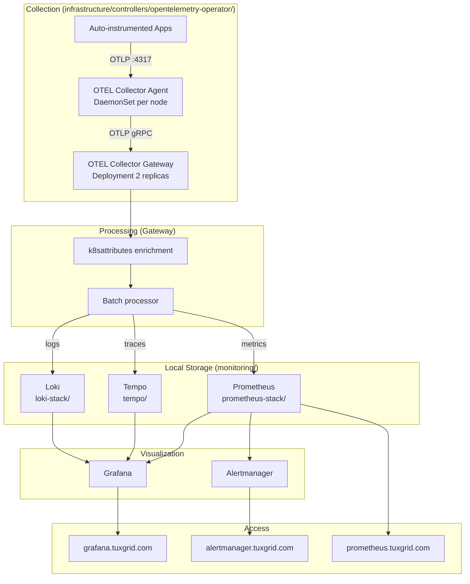

# Monitoring & Observability Stack

Full three-pillar observability (metrics / logs / traces) for the cluster,
fully self-hosted: metrics in Prometheus, logs in Loki, traces in Tempo,
visualized in Grafana. No SaaS in the pipeline.

## Architecture



## Design notes

Everything is self-hosted — no SaaS in the pipeline. Each signal has one
authoritative sink so there's never a "which one do I trust" question:

| Signal  | Sink                            | Query in      |
|---------|---------------------------------|---------------|
| Metrics | Prometheus (`prometheus-stack/`)| Grafana       |
| Logs    | Loki (`loki-stack/`)            | Grafana Explore |
| Traces  | Tempo (`tempo/`)                | Grafana Explore |
| Alerts  | Alertmanager                    | alertmanager.tuxgrid.com |

Retention: metrics 15d, logs 30d, traces 72h (see table near the bottom).
For anything longer-term, export from Loki/Tempo to S3 before rotation.

## Components

| Component | Location | Purpose |
|-----------|----------|---------|
| **OTEL Operator** | `infrastructure/controllers/opentelemetry-operator/` | Manages Collectors + auto-instrumentation |
| **OTEL Agent** | Same (CRD: `collector-agent.yaml`) | DaemonSet, scrapes pod logs via filelog, receives OTLP |
| **OTEL Gateway** | Same (CRD: `collector-gateway.yaml`) | Centralized processing, fan-out to all backends |
| **Prometheus** | `monitoring/prometheus-stack/` | Metrics storage, alerting, Grafana |
| **Loki** | `monitoring/loki-stack/` | Log storage (S3 on RustFS) |
| **Tempo** | `monitoring/tempo/` | Trace storage (S3 on RustFS) |

## Auto-Instrumentation

The OTEL Operator injects OTEL SDKs into pods automatically. Opt-in by
adding an annotation to a Deployment's *pod template*:

```yaml
spec:
  template:
    metadata:
      annotations:
        instrumentation.opentelemetry.io/inject-nodejs: "true"
        # also available: inject-java, inject-go, inject-dotnet
```

> 🚫 **Do NOT use `inject-python: "true"`.** We tried it — the OTEL Python
> SDK init container crashed every Python app in the cluster. If you need
> tracing for a Python service, use the OTEL Python SDK manually inside the
> app (don't use the operator's auto-injection). Node.js / Java / Go /
> .NET auto-injection works, but validate on a canary pod first.

### When auto-instrumentation "silently fails"

Common failure modes, in order of likelihood:

1. **Annotation is on the Deployment, not the pod template.** It must be
   on `spec.template.metadata.annotations`, not `metadata.annotations`.
2. **Init container OOMed.** The injected SDK downloads at startup; some
   apps with tight memory limits kill it. Check
   `kubectl describe pod <pod>` for `OOMKilled` on the init container.
3. **Instrumentation CR not matching.** The `Instrumentation` CR
   (`infrastructure/controllers/opentelemetry-operator/instrumentation.yaml`)
   defines which image / endpoint is injected. If it's not in the same
   namespace as the pod (or a selectable namespace), the webhook skips.
4. **Webhook wasn't running at pod-create time.** Annotations are only
   applied by the mutating webhook on *creation*. Existing pods need a
   rollout (`kubectl rollout restart deploy/<name>`) after you add the
   annotation.
5. **Network policy / Cilium rule blocks OTLP.** Apps send to the Agent's
   OTLP port (`:4317` on the node). If a NetworkPolicy blocks egress to
   the DaemonSet, traces never leave the pod.

Verify an app is actually instrumented:
```bash
kubectl describe pod <pod> | grep -A5 'Init Containers'
# Should show an 'opentelemetry-auto-instrumentation-*' init container.
```

## Kubernetes Metrics: Two Pipelines

Two sources of Kubernetes metrics — they are NOT interchangeable:

```
                    kubelet :10250/metrics
                   /                       \
        Prometheus scrapes              metrics-server polls
               ↓                               ↓
      stores in time-series DB         holds latest snapshot in memory
               ↓                               ↓
      Grafana, Alertmanager            HPA, kubectl top
```

| | **Prometheus** | **metrics-server** |
|---|---|---|
| **What it stores** | Historical time-series (15-day retention) | Last ~30 seconds only, in-memory |
| **Consumers** | Grafana, Alertmanager | HPA, `kubectl top` |
| **Installed via** | `monitoring/prometheus-stack/` (Wave 5) | `infrastructure/controllers/metrics-server/` (Wave 4) |

If `kubectl top` works but Grafana dashboards are empty, metrics-server is
fine and Prometheus is the problem. If HPA is stuck at "unknown" but
Grafana has data, it's the reverse.

## Storage Backends

| Component | Storage | Location |
|-----------|---------|----------|
| Prometheus | Longhorn PVC (20Gi) | Local cluster |
| Grafana | Longhorn PVC (5Gi) | Local cluster |
| Alertmanager | Longhorn PVC (2Gi) | Local cluster |
| Loki | RustFS S3 (`loki` bucket) | TrueNAS 192.168.10.133:30293 |
| Tempo | RustFS S3 (`tempo` bucket) | TrueNAS 192.168.10.133:30293 |

> Loki/Tempo credentials go in via `extraEnvFrom: secretRef:` — do NOT
> reference `${VAR}` inline in the Helm values; those don't expand and
> the pod silently runs with no creds. See `monitoring/CLAUDE.md`.

## Access

| Service | URL |
|---------|-----|
| Grafana | https://grafana.tuxgrid.com |
| Prometheus | https://prometheus.tuxgrid.com |
| Alertmanager | https://alertmanager.tuxgrid.com |
| Loki | https://loki.tuxgrid.com |

## Key Files

- Custom ServiceMonitors: `monitoring/prometheus-stack/custom-servicemonitors.yaml`
- Custom alerts: `monitoring/prometheus-stack/custom-alerts.yaml`
- GPU alerts/dashboard: `monitoring/prometheus-stack/gpu-alerts.yaml`, `gpu-dashboard.yaml`
- OTEL Collectors: `infrastructure/controllers/opentelemetry-operator/collector-*.yaml`
- Auto-instrumentation: `infrastructure/controllers/opentelemetry-operator/instrumentation.yaml`

## Retention

| Signal | Retention |
|--------|-----------|
| Metrics | 15 days (Prometheus) |
| Logs | 30 days (Loki) |
| Traces | 72 hours (Tempo) |
| Alerts | 72 hours (Alertmanager) |

## Troubleshooting

```bash
# OTEL Collector pods & health
kubectl get pods -n opentelemetry
kubectl logs -n opentelemetry -l app.kubernetes.io/component=opentelemetry-collector

# Prometheus scrape targets
# Visit: https://prometheus.tuxgrid.com/targets

# Loki is receiving logs — in Grafana Explore, try:
#   {k8s_namespace_name=~".+"}
# Labels are OTEL-semconv style (dots → underscores) because logs come from the
# OTEL Gateway's loki exporter, NOT Promtail. Available labels include:
#   k8s_cluster_name, k8s_namespace_name, k8s_pod_name, k8s_container_name,
#   k8s_deployment_name, k8s_daemonset_name, k8s_statefulset_name,
#   k8s_replicaset_name, service_name
# Querying `{namespace=~".+"}` returns "No data" — that Prometheus-legacy label
# does not exist here. If the right selector also returns nothing, then check
# Loki's ingester + the Gateway's loki exporter.

# Trace a specific app's pipeline end-to-end
kubectl logs -n opentelemetry ds/collector-agent        # agent received spans?
kubectl logs -n opentelemetry deploy/collector-gateway  # gateway forwarded?
```

### Common pitfalls (see `monitoring/CLAUDE.md` for details)
- Tempo/Loki S3 creds: use `extraEnvFrom: secretRef:`, not inline `${VAR}`.
- ArgoCD metrics: must be per-component (`controller.metrics`, `server.metrics`, …) — top-level `metrics:` does nothing.
- Longhorn ServiceMonitor: select `app: longhorn-manager` (NOT `app.kubernetes.io/name: …`).
- `ignoreDifferences`: use `jqPathExpressions`, not `jsonPointers` (RFC 6901 has no `*` wildcard).
- PVC storage in `ignoreDifferences`: must ignore `.spec.resources.requests.storage` (PVCs can't shrink).
- Loki tenant_id: multi-tenant mode requires `X-Scope-OrgID` header or `tenant_id` — 401 without it.
- OTEL Collector CRD versions: `v1beta1` for `OpenTelemetryCollector`, `v1alpha1` for `Instrumentation`.
